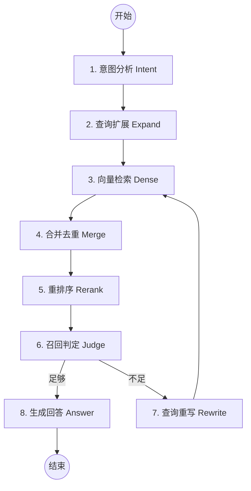

# StructuredRAGAgent 深度解析文档

本文档旨在详细解释 `agent/structured_rag.py` 中实现的生产级 RAG（检索增强生成）流程。该架构基于 LangGraph 构建，采用了多步推理和自我修正机制。

---

## 核心流程图 (Mermaid)

---

## 节点详细拆解

### 1. 意图分析 (Intent Node)

* **做了什么**：分析用户问题的任务类型（如问答、对比、提取）并提取关键实体。
* **为什么这么做**：不同的问题需要不同的处理策略。实体提取有助于在后续节点中聚焦核心信息。
* **优点**：提高系统对复杂问题的理解能力。
* **缺点**：增加了一次模型调用开销。
* **举例**：
  * *输入*："对比一下 LangChain 和 LlamaIndex 的索引机制。"
  * *输出*：`task_type: 'Comparison'`, `entities: ['LangChain', 'LlamaIndex', '索引机制']`

### 2. 查询扩展 (Expand Node)

* **做了什么**：基于原问题和实体，生成 3 个语义相关的扩展查询。
* **为什么这么做**：用户的问题往往表述不全，通过扩展可以从不同角度切入向量空间，提高召回率。
* **优点**：极大地解决了“表述不一致”导致的检索失败。
* **缺点**：检索量增加 3 倍，压力增大。
* **举例**：
  * *扩展 1*："LangChain vector store indexing implementation"
  * *扩展 2*："LlamaIndex storage context and index types"
  * *扩展 3*："Comparison of indexing strategies in LLM frameworks"

### 3. & 4. 向量检索与合并 (Dense & Merge Nodes)

* **做了什么**：执行多路并发检索，并对结果按内容进行唯一化去重。
* **为什么这么做**：扩展查询会召回大量重叠或冗余的文档，去重能减少后续重排序的计算量。
* **优点**：保证了上下文的多样性同时控制了 Token 长度。

### 5. 重排序 (Rerank Node)

* **做了什么**：使用模型对每一个召回的片段进行“相关性打分”（0-1）。
* **为什么这么做**：向量检索只保证“语义接近”，不保证“逻辑相关”。重排序能把真正能回答问题的片段排到前面。
* **优点**：显著提高最终回答的准确率。
* **缺点**：如果文档较多，逐条打分非常慢（通常生产环境会用交叉编码器，这里为了通用用了 LLM）。

### 6. 召回判定 (Judge Node)

* **做了什么**：审视所有入选文档，判断其是否足以支撑问题的解答。
* **为什么这么做**：**这是 RAG 防止幻觉的关键。** 如果检索不到东西，直接去重写问题，而不是强行让模型瞎编。
* **优点**：实现自我修正（Self-Correction）循环。
* **举例**：
  * *问题*："公司的咖啡机怎么修？"
  * *召回内容*：全是关于公司年假制度的文档。
  * *判定*：`sufficient: False` -> 进入重写流程。

### 7. 查询重写 (Rewrite Node)

* **做了什么**：当判定召回不足时，对原问题进行彻底重写，使其更适合搜索引擎。
* **为什么这么做**：有时候是用户问得太主观，重写成客观查询往往能起死回生。
* **优点**：提供第二次检索机会。
* **缺点**：如果确实知识库里没内容，可能会陷入死循环（代码中通常会加次数限制）。

### 8. 生成回答 (Answer Node)

* **做了什么**：基于高质量的上下文生成 Markdown 格式的回答。
* **为什么这么做**：最后的收官，要求严谨，禁止编造。

---

## 总结

| 特性 | 说明 |
| :--- | :--- |
| **最大优点** | **极高的可靠性**。通过意图识别和质量判定，极大地降低了模型产生“幻觉”的概率。 |
| **主要缺点** | **延迟较高**。整个流程链路较长，尤其是涉及到重排序和循环重写时，首字响应时间（TTFT）会变长。 |
| **适用场景** | 企业内网知识库、技术支持、严谨的合规咨询。 |
| **设计哲学** | 宁可说“我不知道”，也不要自作聪明。 |
