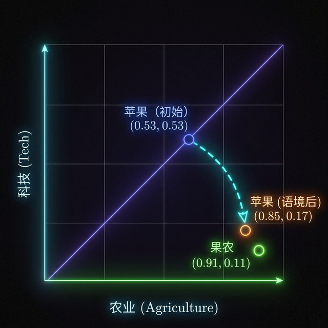

"""
input: 背景知识、Transformer 架构、注意力机制解释
output: 提示词工程底层逻辑与实战技巧
pos: 位于系统“开发经验&知识扩展”层，负责解释 LLM 运行机制与 Prompt 优化策略
声明：一旦本文件逻辑更新，必须同步更新本文件注释并更新所属目录的 README.md
"""

# 提示词工程：核心原理与实战指南

关于提示词工程（Prompt Engineering），有两个贯穿始终的核心观点：

> **观点 1**： `模型输出质量 = 提示词信息量 × 语境清晰度 × 约束明确度`
> **观点 2**： `优秀提示工程的本质是：控制概率分布。`
> 
**信息量**:`提示词中包含的具体事实性信息的多少，信息越具体、出现概率越低，信息量越高。`

**语义清晰度**: `提示词能否让AI将任务映射到唯一的任务类型，任务类型越唯一，清晰度越高。`

**约束明确度**: `提示词对AI输出内容的限制条件是否具体，限制条件越明确，AI输出越可控。`

>例子1：提示词“写个报告”
• 信息量：0.3
依据：仅提到“报告”这一模糊类型，未说明主题、项目、时间、受众等关键信息。
• 语义清晰度：0.4
依据：能理解“写报告”提取到的“写报告”这一模糊概念（$\text{Value}$），但任务背景缺失导致注意力无法聚焦。
• 约束明确度：0.2
依据：无格式、内容模块、字数、侧重点等约束，AI可自由发挥。
• 质量计算：0.3×0.4×0.2=0.024

>例子2：提示词“写Ras项目上周进度报告，包含3个核心任务、未解决问题和下周计划”
• 信息量：0.8
依据：明确项目、时间、核心内容模块，信息具体且完整。
• 语义清晰度：0.9
依据：“Ras项目上周进度报告”直接指向研发同事熟悉的工作场景，语义无歧义。
• 约束明确度：0.9
依据：强制要求包含“3个核心任务、未解决问题、下周计划”3个模块，限制AI的输出范围。
• 质量计算：0.8×0.9×0.9=0.648

为了真正理解这两句话的含义，我们需要先从大语言模型的底层运行机制说起。

## 一、 为什么提示词能控制人工智能？

大语言模型（如 GPT 系列）的架构源自经典的 **Transformer** 模型。


上图展示的是经典的 **Encoder–Decoder（编码器-解码器）** 结构，其工作原理大致如下：
- **Encoder（编码器）**：负责理解和提取输入信息。
- **Decoder（解码器）**：负责根据理解的信息生成输出。
- **Attention（注意力机制）**：建立输入与输出之间信息关联的核心机制。

然而，现代大语言模型（如 GPT）**只使用了 Decoder 部分**。原因很简单：

> GPT 的核心任务不是“先完整理解完所有内容，再进行输出”，而是**在已有文本的基础上，预测下一个最可能的 token（词元）。**

它的主要目标函数可以表示为：
$$
P(\text{token}_t \mid \text{token}_1, \ldots, \text{token}_{t-1})
$$

因此，**输入的 Prompt 本身就构成了上下文（Context）**，模型不需要一个独立的 Encoder 来处理输入，直接利用 Decoder 进行自回归预测即可。

### GPT 的实际运行流程

具体来说，GPT 是一个**自回归循环系统**。它的完整运行流程如下：

```lisp
             ┌────────────────────────────┐
             │         初始 Prompt         │
             └──────────────┬─────────────┘
                            ↓
                    Tokenizer 分词
                            ↓
                     Embedding (向量化)
                            ↓
                  + Positional Encoding (位置编码)
                            ↓
             ┌──────────────────────────┐
             │     Decoder Blocks × N   │
             │  (Masked Multi-Head Attn)│
             │     + Feed Forward       │
             └──────────────┬───────────┘
                            ↓
                    Linear Projection (线性投影)
                            ↓
                        Softmax (归一化)
                            ↓
                   [采样策略 (Temp/Top-K/P)]
                            ↓
                 预测下一个 Token (最终选择)
                            ↓
                 ┌──────────┴──────────┐
                 │ 是否结束？(EOS / max)│
                 └──────────┬──────────┘
                            │
                 否 ────────┘
                            ↓
            将新Token拼接到序列末尾
                            ↓
                     回到 Decoder 继续循环
```

---

## 二、 全流程实战演示：从 Tokenizer 到预测下一个词元

为了真正理解大模型内部的数学流动，以提示词 **`“果农摘苹果”`** 为例，拆解一遍完整的 Transformer 推理流水线。

---

### 第一步：分词 (Tokenizer) —— 词表映射
在模型眼中没有汉字，只有数字。
| 文本片段 (Token) | ID |
| :--- | :--- |
| **果农** | `30421` |
| **摘** | `2105` |
| **苹果** | `8562` |

---

### 第二步：Embedding —— 语义空间化
将 ID 转换为高维向量。*假设维度 $d=2$：[维度 1: 农业/水果, 维度 2: 科技/电子]*

| Token | Input Vector ($X = E + P$) | 说明 |
| :--- | :--- | :--- |
| **果农** | `[0.91, 0.11]` | 明显的农业方向 |
| **摘** | `[0.42, 0.52]` | 属性较中性 |
| **苹果** | `[0.53, 0.53]` | **模糊态**（向量指向中间） |

#### 语义空间图化 (Semantic Vector Space)
下图展示了 Token 在该简化维度空间中的分布。可以看到“苹果”最初位于农业与科技的中间地带，通过注意力机制计算后，它被“果农”强力拉向了农业维度。



*(注：3B1B 风格图例，展示了注意力机制如何物理改写向量位置)*

---

### 第三步：自注意力矩阵 (Attention Matrix) —— 核心语境捕捉
这是模型计算“谁该关注谁”的阶段。我们将每个词的 **Query (查询)** 与 **Key (标签)** 进行交叉点积。

#### 1. Attention Weights 权重分布矩阵

> **注**：行代表 **Key (标签)**，列代表 **Query (查询)**。数值代表列方向上的 Token 在多大程度上受到行方向 Token 的影响。

| | **果农 ($Q_1$)** | **摘 ($Q_2$)** | **苹果 ($Q_3$)** |
| :--- | :--- | :--- | :--- |
| **果农 ($K_1$)** | `0.90` | `0.10` | **`0.85`** |
| **摘 ($K_2$)** | `0.05` | `0.80` | `0.05` |
| **苹果 ($K_3$)** | `0.05` | `0.10` | `0.10` |

> **数学透视**：观察最后一列 `苹果 ($Q_3$)`。模型发现与其 $Q$ 最匹配的 $K$ 是 `果农` (0.85)。这意味着：**“苹果”这个词的最终语义将由“果农”来重新塑造。**

---

### 第四步：语义融合与变换 (Synthesis & FFN)
融合了语境的向量 $Z$ 进入前馈网络（FFN）。

| Token | 融合后向量 $Z$ (加权 V) | FFN 处理结果 (Pattern Matching) |
| :--- | :--- | :--- |
| **苹果** | `[0.85, 0.17]` | 激活“采摘水果”、“口感”等相关节点 |

---

### 第五步：线性映射与 Softmax —— 最终预测
最后，模型计算下一个 Token 的出现概率分布。

| 候选词 | Logit (原始分) | **Softmax (最终概率)** |
| :--- | :--- | :--- |
| **的** | `8.2` | **`65%` (概率尖峰)** |
| **了** | `7.1` | `25%` |
| **发布** | `-2.5` | `0.01%` |

#### 📊 采样干预：如何进一步微调概率分布？
在最终选词前，我们可以通过三个参数来人工“修剪”这个概率分布图：

1.  **Temperature (温度)**：控制分布的“陡峭”程度。
    - **低温度 (<1.0)**：会让高的更高、低的更低，使输出极其**保守、确定**（锁定在那个 65% 的尖峰上）。
    - **高温度 (>1.0)**：会抹平差异，让低概率词也有机会露脸，使输出更具**随机性、创造性**。
2.  **Top-K**：物理切断。
    - 只从概率最高的 **K** 个词中进行选择。这直接砍掉了概率分布的长尾，防止 AI 蹦出完全无关的胡话。
3.  **Top-P (核采样)**：动态切断。
    - 累加概率直到达到 **P** (如 0.9)。这能根据分布的宽度动态调整候选范围，既保证了多样性，又通过概率阈值维持了逻辑。

---


至此，我们可以对本文开篇提到的 **观点 2** 进行闭环论证：

> **观点 2**：`优秀提示工程的本质是：控制概率分布。`

**论证结论**：
1.  **物理层面的预设**：当你写下“果农”时，你不是在给 AI 下指令，而是在 Transformer 的 **Key (标签) 空间**里埋下了一个高维坐标点。
2.  **权重的强制偏移**：当后续词“苹果”出现并生成 **Query (查询)** 时，注意力机制会物理性地被你埋下的坐标点“吸”过去。
3.  **概率分布的剪裁**：这种权重的偏转，经过前馈网络（FFN）的放大，最终在输出层的 Softmax 中将原本属于“电子产品”的概率分布全部压平，而将“水果农产”的概率拉高。


---

## 三、 提示词实战指南与工具

基于大模型的底层工作逻辑，当 AI 的输出不如预期时，我们可以进行标准化的**“三步诊断”**：

1. **缺料吗？**（检查 **信息量**：事实与素材是否充足？）
2. **跑调吗？**（检查 **语境**：身份与对象设定是否明确？）
3. **乱套吗？**（检查 **约束**：格式与框架结构是否具体？）

### 🛠️ 实战工具：CO-STAR 模型映射表

为了更好地落地实战，我们可以将这套核心公式完美应用于现今最流行的 **CO-STAR 框架**中，借此精准控制 AI 内部的概率分布：

| **公式维度** | **CO-STAR 元素** | **填写指南** |
| --- | --- | --- |
| **1. 信息量** (Input) | **C** - Context (背景) <br> **O** - Objective (目标) | **提供燃料：** 描述目前的具体情况、面临的问题、以及你最终想达成的具体结果。 |
| **2. 语境度** (Clarity) | **S** - Style (风格) <br> **T** - Tone (语气) <br> **A** - Audience (受众) | **精准滤镜：** 指定模仿对象（如：资深架构师）、口吻（如：冷静专业）以及内容重点是给谁看的。 |
| **3. 约束力** (Constraint) | **R** - Response (响应) | **打造模具：** 明确规定输出格式（表格、JSON、Markdown）以及必须包含的章节或步骤要求。 |

---

### 📝 终极秘籍：写出顶级 Prompt 的三步法

无论你的需求多么复杂，只需要牢记并执行以下三步，就能写出能够锁定“概率尖峰”的优质提示词：

1. **堆素材 (C+O) —— 消除事实真空**：别让 AI 猜。把业务背景、具体事实和核心目标写清楚，提供充足的信息量。
2. **定调子 (S+T+A) —— 消除理解歧义**：像导演讲戏一样给 AI 定戏路。明确模仿对象的视角、情感基调和受众的身份偏好。
3. **设护栏 (R) —— 消除逻辑盲目**：不要给出开放式的要求。提供明确的模块清单、结构要求和格式示例，确保生成路径始终按规矩前行。

理解并应用了这些核心原理，你不仅掌握了写好提示词的表面技巧，更是真正掌握了驾驭大模型的底层思维引擎。
---

## 四、 延伸问答（大模型底层运行逻辑应用）

**基于本篇文档提取出的大模型底层机制（如 Transformer Decoder 结构、Attention 注意力机制、Softmax 概率分布等），解答以下 4 个常见问题：**

### 1. 为什么长上下文（或者多轮回答后，询问之前的问题），输出的答案的质量变低？

**原理依据**：大模型本质上是通过 **多头注意力机制（Self-Attention）** 在寻找词与词之间的依赖关系。在这个机制中：
*   **$Q$ (查询向量)** 想去匹配之前的 **$K$ (标签向量)**，并算出匹配度（权重）。
*   然后通过 **Softmax** 进行数学上的归一化（所有词的权重概率之和必须等于 1 或 100%）。

**原因解析**：
当处于长上下文或多轮对话中，输入的 Token 数量急剧增加。即使你在第一轮设定了极度强力的背景要求，但在第 10 轮时，当前词的 $Q$ 被迫要去和前面成千上万个日常对话词汇的 $K$ 进行匹配计算。
由于 Softmax 的“分母”变大了（候选词爆炸），早期关键指令的注意力权重被严重的**“概率稀释”**。模型能从早期上下文中提取到的 $V$ (真实语义) 变得极其微弱。此时，前馈网络（FFN）接收不到足够强的特定语境特征，只能转而输出所有词汇的“最大公约数”，导致回答变得随机、平庸、甚至完全忘记了之前的设定要求。

*   **举例**：在多轮对话中，你第 1 轮让 AI 扮演“刻薄的导师”，之后你跟它聊了 20 轮各种菜谱。到第 22 轮你让它评价你的论文时，由于“刻薄”这一特征词的 Attention 权重被 20 轮菜谱词汇严重稀释，AI 输出了温柔客气的客套话，质量随之崩塌。

---

### 2. 什么是AI幻觉，从产生原因开始，举例回答

**定义**：AI 幻觉是指模型输出了看似行文流畅、逻辑连贯，但实际上**毫无事实根据、凭空虚构或脱离现实**的内容。

**原因解析（基于底层运行机制）**：
1.  **事实真空引发的“大脑自动补全”**：文档中提到，如果缺乏“信息量（事实与依据）”，AI 的注意力机制（Attention）就找不到聚焦点，变成了一个**信息孤岛**。因为模型是被训练来“预测下一个概率最高的词”的，面对信息真空，前馈网络（FFN）只能启动盲目的补抓机制，靠词表中“平庸的概率分布自行脑补”。
2.  **温度参数（Temperature）失控**：如果调高温度 `Temp > 1`，原本低概率词（不相关的词）的差距会被抹平。AI 会因为缺乏强力约束（地心引力）而“迅速滑向幻觉和胡言乱语”。

*   **举例**：如果你问 AI：“请详细介绍一下苹果公司在2026年发布的『Apple iCar-飞天版』汽车”。
    世界上不存在这款车（输入缺乏真实事实），但因为你的句子里有“苹果公司”、“发布”和“汽车”。AI 的注意力机制会立刻链接到“科技感”、“流畅体验”、“Tim Cook”等极速词汇。最后，AI 会用无可挑剔的“苹果发布会风格（语境正确）”为你编造出这款汽车甚至包含虚构的百公里加速数据，这就是典型的 AI 幻觉。

---

### 3. 为什么 AI 对提示词开头和结尾的指令更敏感，而容易忽略中间的内容？（“迷失在中间”现象）

**现象描述**：
在长提示词中，如果你把关键要求（比如格式要求、安全声明或最重要的业务规则）放在文本的开头或结尾，大模型通常能很好地遵循；但如果你把同样重要的指令夹在几千字长文的正中间，它极大概率会直接忽略掉。学术界将这种现象称为 **"Lost in the Middle"（迷失在中间）**。

**原因解析（基于底层运行机制）**：

1.  **注意力机制（Attention）的“首尾锚点效应”**：
    Decoder 架构的核心是自注意力机制（Self-Attention），它在计算任意两个 Token 之间的关联权重（$QK^T$）时，理论上能够看到全局。但在长文本的实际计算中，注意力并非均匀分布：
    *   **开头的高权重**：模型在刚开始接收指令时，处于“信息饥渴”状态，开篇定调的句子由于没有被前面的杂乱信息稀释，其特征向量（$V$）在初步网络中留下的印记最深，形成了一个强力的“认知底稿”。
    *   **结尾的即时性**：对于自回归生成的模型（预测下一个词），紧靠在“即将要输出的位置”之前的文本，也就是结尾的指令，在空间距离上离当前生成的 Token 最近。这些词带来的约束可以直接主导最终一层的 前馈网络（FFN）提取与 Softmax 分数映射。

2.  **中间信息的“概率塌陷”与“相互干扰”**：
    当你向提示词中塞入大量中间信息（如几十条具体案例或参考文档）时，这一大片区域形成了高密度的信息噪音。当模型开始计算时，中间部分的词与词之间会相互产生大量的长尾注意力分数，导致这部分区域的特征聚合变得非常扁平化（概率被严重稀释）。如果把唯一的一条关键指令藏在这里，它的微弱信号在经过几层 Decoder 后，就会被前后大基数的内容彻底淹没。

**实战运用（如何规避）：**

*   **三明治法则**：把最重要的信息（目标、受众、约束）放在**开头（Top）**和**结尾（Bottom）**。
*   **素材放中间**：中间区域只用来堆叠“提示词信息量”（长文档、会议记录、参考资料等），不要在里面夹杂逻辑判断和格式指令。
*   **最后一次强调**：在整个长提示词的最后一行，永远放一句最具约束力的话（即 CO-STAR 里的 R: Response 响应格式要求），强迫注意力在最后一次收拢。如：`“请仔细阅读上方资料，并严格按照 JSON 格式输出最终摘要。”`

---

### 4. 什么是提示词里的 Zero-Shot 和 Few-Shot 机制？为什么提供示例能大幅提高输出准确率？

**定义**：在提示词工程中，“Shot”是指向大模型提供的**示例（Examples/Samples）**。
*   **Zero-shot（零样本）**：不给任何例子，直接让模型执行任务。
*   **One-shot / Few-shot（单样本 / 少样本）**：先给出一个或几个标准的“输入-输出”对作为示范，再让模型执行新任务。

**原理依据（基于底层运行机制）**：
对照文档中《三步法之 3. 设护栏 (R)》所写：**“不要给出开放式的要求。提供明确的模块清单、结构要求和格式示例”**。
从微观计算的角度来看，提供 Shot 示例，本质上就是用实实在在的结构体文本，给 Transformer 的 Decoder Blocks 强行注入了高质量的特征认知（$X$）和隐式的依赖图。
哪怕模型自身不带“推断学习”能力（权重并未在推理时改变），它强大的上下文 Self-Attention 也会瞬间“抄写”你示例中的模式：它会计算出你的“输入”词和“输出”结构之间的相对距离、符号格式。这股力量会将下一步输出的概率极限压缩在你定死的格式空间中，极大程度上消除了生成时的“逻辑盲目”。

*   **实战举例的巨大差异**：
    假设你要让 AI 做客户评价的情感分类。
    *   **Zero-shot（没例子，大概率废话多）**：“帮我把下面这句话分类为正面或负面：这吹风机声音太大了吧。”
        *   *AI 的实际回答（偏离预期）*：“这句话表达了客户对产品噪音的不满，应该被归类为负面情绪。”（注意：没有按格式要求只说极简情绪词）。
    *   **One-shot（有例子，概率强制收拢）**：
        ```text
        【示例】
        评论：风力很足，喜欢！ => 正面
        
        【任务】
        评论：这吹风机声音太大了吧。 => 
        ```
        *   *AI 的实际回答（精准）*：`负面`。（在这种带有强烈排版约束与示例前导的输入下，多余的解释性词汇在 Softmax 这一层的概率被直接碾碎）。

---

### 5. 在 Few-Shot（提供示例）时，模型的 Attention 机制究竟是如何“瞬间抄写”示例中的模式、符号与格式的？

**现象疑问**：
在问题 4 中提到了：**“它强大的上下文 Self-Attention 也会瞬间‘抄写’你示例中的模式：它会计算出你的‘输入’词和‘输出’结构之间的相对距离、符号格式”**。既然大模型的参数（权重）在推理时是锁死不变的，它并没有在“重新训练”，那它是靠什么物理机制，在瞬间学会并照抄这套格式的？

**底层数学机制拆解（“上下文内学习” In-Context Learning 现象的微观本质）**：

其实，秘密就藏在 Decoder 架构最初始床底的**位置编码（Positional Encoding）**和**注意力矩阵（Attention Matrix）**的巧妙结合中：

1.  **位置编码（Positional Encoding）带来的“距离透视眼”**：
    当 Token 进入模型时，模型不仅仅得到了词汇本身的向量（如“风力”、“正面”、“=>”），还不可撤销地叠加上了绝对与相对的高维位置坐标。当你给出示例 `【任务】评价 => [情绪]` 时，这个“=>”并不是一个普通的符号，它身上裹挟着一个明确的空间距离坐标：它和前后的词之间有着固定的**相对位置间隔（Relative Offset）**。
2.  **特定的 Attention Head 化身为“格式复制机”**：
    在具有数十层的多头注意力（Multi-Head Attention）网络中，学术界研究发现，有部分特定的注意力“头”专门负责扮演 **"Induction Heads"（感应头）** 的角色。
    *   **动作 1（寻找历史前车之鉴）**：当模型读取到你给出的新任务题干 `这吹风机声音太大了吧。 => ` 时，当前 Token（此时是“=>”）的查询向量 $Q$ 被彻底激活。它的 $Q$ 开始向历史前文进行全局扫描。
    *   **动作 2（触发强匹配）**：因为历史前文中，恰好有一个完全相同的结构 `风力很足，喜欢！ => 正面`！由于语境前缀的高度相似性，当前的“=>” 瞬间与文中之前那个“=>”的标签向量 $K$ 算出了一个高得离谱的注意力分数（Softmax 权重爆表）。
    *   **动作 3（跨位移复印）**：一旦锁定前文的那个“=>”位置，这些专门负责格式复制的 Induction Heads 就发生了一个巧妙的“位移提取”：前文的“=>”本身并没有实际词义，但它的后一个位置站着的是代表极简选项格式的特征词 “正面”。**模型提取并重构的真实内容（$V$）并不是“=>”自身，而是这套带有相对距离偏移量（+1 Offset）的排版逻辑信息与后续的候选词空间。**
3.  **结果输出（概率钳制）**：
    当这个满载着“前文格式规律特征”的巨型综合向量流动到最终的概率投射层（Linear Projection）时，模型已经通过上述机制在内部深层达成了共识：**“在 ‘=>’ 后面，我只能从那几个极简情绪词（正面/负面）中去挑，不能说废话”**。多余的句法连接词的概率就这样在数学上被直接清空。

**总结**：
所谓“瞬间抄写模式”，在底层算法上，是模型依赖**位置编码**识别出了前文重复出现的结构标记符号（如 =>，或者换行符、JSON 花括号），并利用专门的**感应头（Induction Heads）**将新输入的位置强行“对齐”到前文相同语境的坐标，从而跨距离把格式规则像复制粘贴一样，烙印到了即将生成的下一个 Token 的概率分布上。